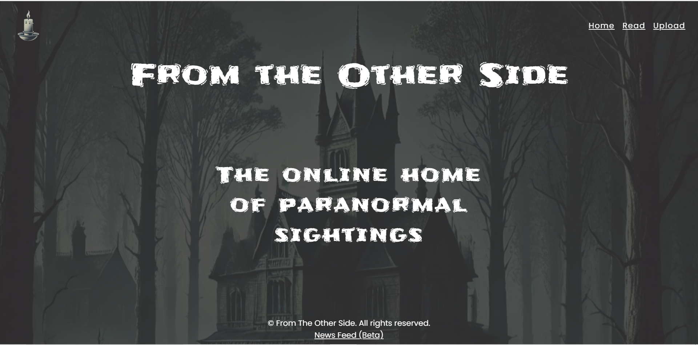
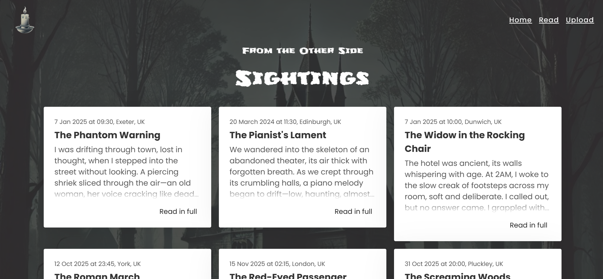
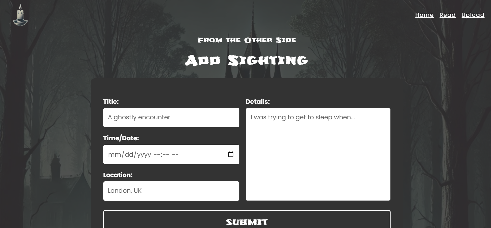
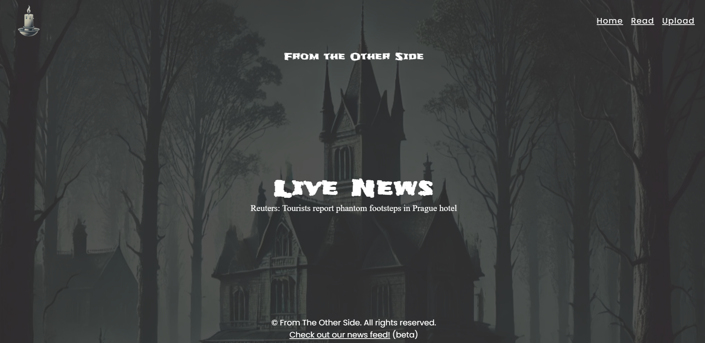

```markdown
# 👻 From The Other Side: Ghost Tracker & Live News

[](https://render.com/deploy?repo=https://github.com/Muhammad-Zubair796/Web-Dev)


A high-performance, full-stack paranormal activity tracker. This project demonstrates how to handle real-time data streams and secure user input using vanilla Node.js.

---

## 🌐 Live Demo
Experience the hauntings here:  
**[https://web-dev-hn7s.onrender.com/](https://web-dev-hn7s.onrender.com/)**

---

## 📸 App Screenshots
| Home & Sightings | Live News Feed |
|---|---|
|  |  |
| **Upload Sighting** | **Mobile View** |
|  |  |

---

## 🚀 Technical Features & Implementation

### 1. Real-Time Streaming (SSE)
Instead of making the browser "ask" for updates repeatedly (polling), I implemented **Server-Sent Events (SSE)**.
- **The Tech:** Uses the `text/event-stream` header to keep a persistent HTTP connection open.
- **Efficiency:** The server pushes new headlines to the client instantly as they happen, reducing latency and server load.

### 2. Security & Data Sanitization
To prevent **XSS (Cross-Site Scripting)** attacks, I built a custom sanitization layer for the "Upload Sighting" feature:
- **Input Cleaning:** All user-submitted text is stripped of dangerous HTML tags.
- **Character Encoding:** Special characters like `<` and `>` are converted to safe entities (`&lt;` and `&gt;`).

### 3. Vanilla Full-Stack Architecture
- **No Frameworks:** Built without Express.js to understand the core of Node.js `http` modules.
- **Custom Static Server:** Manages file paths, MIME types, and 404 error handling manually.
- **RESTful API:** Clean separation between frontend assets and backend data processing.

---

## 🛠️ Installation & Local Setup

1. **Clone the repository:**
   ```bash
   git clone [https://github.com/Muhammad-Zubair796/Web-Dev.git](https://github.com/Muhammad-Zubair796/Web-Dev.git)

```

2. **Navigate to the project folder:**
```bash
cd "Full Stack Node App"

```


3. **Install dependencies:**
```bash
npm install

```


4. **Start the server:**
```bash
npm start

```


5. **Open your browser:**
Go to `http://localhost:8000`

---

## 📁 Project Structure

* `server.js` - Core server logic & routing.
* `handlers/` - Logic for SSE (news) and Sighting API.
* `public/` - Pure HTML, CSS, and JS (no frameworks).
* `data/` - JSON-based persistence for ghost sightings.

---

**Developed with ❤️ by Zubair**
```


