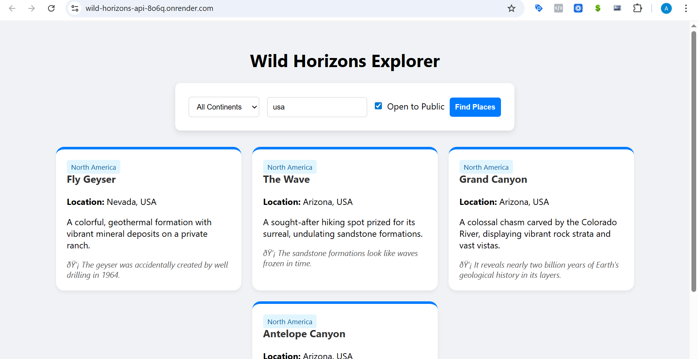

[](https://nodejs.org)
[](https://render.com)
Markdown
# Wild Horizons 🌍

A modern, responsive web application for discovering breathtaking natural wonders from around the world.  
Filter places by continent, country, or whether they are open to the public — and explore detailed descriptions and fun facts.

  
*(Replace this with a real screenshot of your app once deployed)*

## Features

- Browse a curated list of unique natural wonders (caves, lakes, deserts, waterfalls, geological formations, etc.)
- Filter by:
  - Continent
  - Country
  - Accessibility (open to public)
- Clean, card-based UI with fun facts and descriptions
- Responsive design (mobile + desktop)
- Backend API built with Node.js (pure http module — no Express)
- Deployed on Render

## Tech Stack

| Layer       | Technology                  |
|-------------|-----------------------------|
| Frontend    | HTML5, CSS3, Vanilla JavaScript |
| Backend     | Node.js (http module)       |
| Data        | Static JSON-like array      |
| Deployment  | Render.com                  |

No external frameworks or heavy dependencies — pure and lightweight.

## Demo

Live version:  
👉 https://wild-horizons-api-8o6q.onrender.com/

(Sometimes Render free tier may take 10–30 seconds to wake up on first visit)

## Installation & Local Development

1. Clone the repository

```bash
git clone https://github.com/Muhammad-Zubair796/Web-Dev.git
cd Web-Dev

Install dependencies (only needed if you add packages later)

Bashnpm install

Run the server locally

Bashnode server.js

Open in browser:
http://localhost:8000

Project Structure
text.
├── index.html          # Main frontend page
├── style.css           # All styling
├── script.js           # Client-side logic & fetch calls
├── server.js           # Node.js backend + API + static file serving
├── data.js             # Source of all natural wonders data
├── utils/
│   ├── db.js                   # Data loading logic
│   ├── sendJSONResponse.js     # Helper for JSON responses
│   ├── getDataByPathParams.js  # Continent/country filtering
│   └── getDataByQuerryParam.js # Query param filtering
└── package.json
API Endpoints
MethodEndpointDescriptionExampleGET/apiGet all places (with optional query filters)/api?is_open_to_public=trueGET/api/continent/:continentFilter by continent/api/continent/AsiaGET/api/country/:countryFilter by country/api/country/Pakistan
Contributing
Contributions are welcome!

Fork the repository
Create your feature branch (git checkout -b feature/amazing-feature)
Commit your changes (git commit -m 'Add some amazing feature')
Push to the branch (git push origin feature/amazing-feature)
Open a Pull Request

License
This project is open-source and available under the MIT License.
Acknowledgments

Inspired by the world's most fascinating natural locations
Built with passion for travel, geography, and clean web development
Thanks to Render for free & easy hosting

Made with ❤️ in Islamabad, Pakistan
